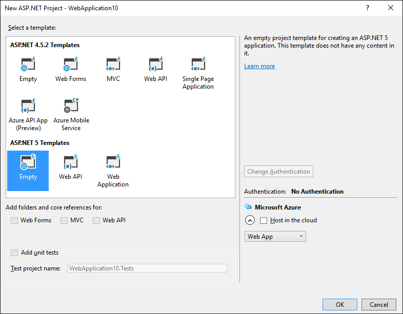
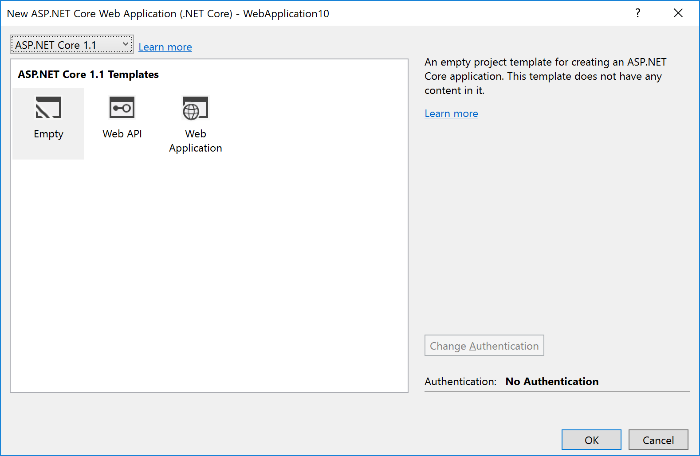
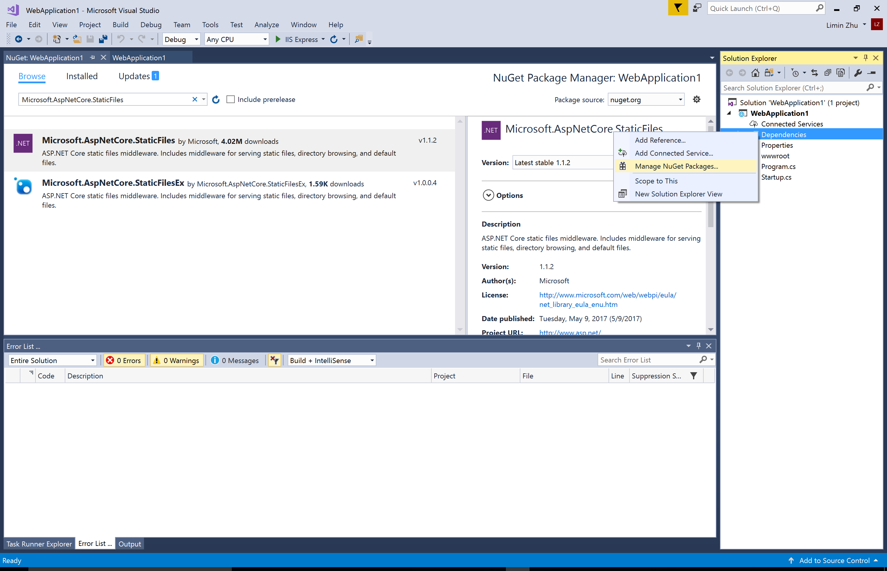
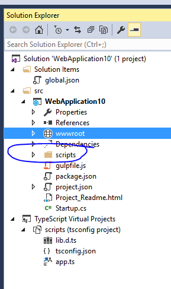

# ASP.NET Core

## ASP.NET Core

### 安装 ASP.NET Core 和 TypeScript

首先，若有需要请[安装 ASP.NET Core](https://get.asp.net)。此篇指南需要使用Visual Studio 2015或2017。

其次，如果你的Visual Studio不带有最新版本的TypeScript，你可以从[这里](http://www.microsoft.com/en-us/download/details.aspx?id=48593)安装。

### 新建工程

1. 选择 **File**
2. 选择 **New Project** （Ctrl + Shift + N）
3. 选择 **Visual C\#**
4. 若使用VS2015，选择 **ASP.NET Web Application** &gt; **ASP.NET 5 Empty**，并且取消勾选“Host in the cloud”，因为我们要在本地运行。

   

5. 若使用VS2017，选择 **ASP.NET Core Web Application \(.NET Core\)** &gt; **ASP.NET Core 1.1 Empty**。

   

运行此应用以确保它能正常工作。

### 设置服务项

#### VS2015

在 `project.json` 文件的 `"dependencies"` 字段里添加:

```javascript
"Microsoft.AspNet.StaticFiles": "1.0.0-rc1-final"
```

最终的 dependencies 部分应该类似于下面这样：

```javascript
"dependencies": {
  "Microsoft.AspNet.IISPlatformHandler": "1.0.0-rc1-final",
  "Microsoft.AspNet.Server.Kestrel": "1.0.0-rc1-final",
  "Microsoft.AspNet.StaticFiles": "1.0.0-rc1-final"
},
```

用以下内容替换 `Startup.cs` 文件里的 `Configure` 函数：

```csharp
public void Configure(IApplicationBuilder app)
{
    app.UseIISPlatformHandler();
    app.UseDefaultFiles();
    app.UseStaticFiles();
}
```

#### VS2017

打开 **Dependencies** &gt; **Manage NuGet Packages** &gt; **Browse**。搜索并安装`Microsoft.AspNetCore.StaticFiles` 1.1.2：



如下替换掉`Startup.cs`里`Configure`的内容：

```csharp
public void Configure(IApplicationBuilder app)
{
    app.UseDefaultFiles();
    app.UseStaticFiles();
}
```

你可能需要重启VS，这样`UseDefaultFiles`和`UseStaticFiles`下面的波浪线才会消失。

## 添加 TypeScript

下一步我们为 TypeScript 添加一个文件夹。


将文件夹命名为 `scripts`。



### 添加 TypeScript 代码

在`scripts`上右击并选择**New Item**。 接着选择**TypeScript File**（也可能 .NET Core 部分），并将此文件命名为`app.ts`。


### 添加示例代码

将以下代码写入app.ts文件。

```typescript
function sayHello() {
  const compiler = (document.getElementById("compiler") as HTMLInputElement).value;
  const framework = (document.getElementById("framework") as HTMLInputElement).value;
  return `Hello from ${compiler} and ${framework}!`;
}
```

### 构建设置

#### 配置 TypeScript 编译器

我们先来告诉TypeScript怎样构建。 右击scripts文件夹并选择**New Item**。 接着选择**TypeScript Configuration File**，保持文件的默认名字为`tsconfig.json`。


将默认的`tsconfig.json`内容改为如下所示：

```javascript
{
  "compilerOptions": {
    "noImplicitAny": true,
    "noEmitOnError": true,
    "sourceMap": true,
    "target": "es5"
  },
  "files": [
    "./app.ts"
  ],
  "compileOnSave": true
}
```

看起来和默认的设置差不多，但注意以下不同之处：

1. 设置`"noImplicitAny": true`。
2. 显式列出了`"files"`而不是依据`"excludes"`。
3. 设置`"compileOnSave": true`。

当你写新代码时，设置`"noImplicitAny"`选项是个不错的选择 — 这可以确保你不会错写任何新的类型。 设置`"compileOnSave"`选项可以确保你在运行web程序前自动编译保存变更后的代码。

#### 配置 NPM

现在，我们来配置NPM以使用我们能够下载JavaScript包。 在工程上右击并选择**New Item**。 接着选择**NPM Configuration File**，保持文件的默认名字为`package.json`。 在`"devDependencies"`部分添加"gulp"和"del"：

```javascript
"devDependencies": {
  "gulp": "3.9.0",
  "del": "2.2.0"
}
```

保存这个文件后，Visual Studio将开始安装gulp和del。 若没有自动开始，请右击package.json文件选择**Restore Packages**。

#### 设置 gulp

最后，添加一个新JavaScript文件`gulpfile.js`。 键入以下内容：

```javascript
/// <binding AfterBuild='default' Clean='clean' />
/*
This file is the main entry point for defining Gulp tasks and using Gulp plugins.
Click here to learn more. http://go.microsoft.com/fwlink/?LinkId=518007
*/

var gulp = require('gulp');
var del = require('del');

var paths = {
  scripts: ['scripts/**/*.js', 'scripts/**/*.ts', 'scripts/**/*.map'],
};

gulp.task('clean', function () {
  return del(['wwwroot/scripts/**/*']);
});

gulp.task('default', function () {
  gulp.src(paths.scripts).pipe(gulp.dest('wwwroot/scripts'))
});
```

第一行是告诉Visual Studio构建完成后，立即运行'default'任务。 当你应答 Visual Studio 清除构建内容后，它也将运行'clean'任务。

现在，右击`gulpfile.js`并选择**Task Runner Explorer**。 若'default'和'clean'任务没有显示输出内容的话，请刷新explorer：


### 编写HTML页

在`wwwroot`中添加一个新建项 `index.html`。 在`index.html`中写入以下代码：

```markup
<!DOCTYPE html>
<html>
<head>
    <meta charset="utf-8" />
    <script src="scripts/app.js"></script>
    <title></title>
</head>
<body>
    <div id="message"></div>
    <div>
        Compiler: <input id="compiler" value="TypeScript" onkeyup="document.getElementById('message').innerText = sayHello()" /><br />
        Framework: <input id="framework" value="ASP.NET" onkeyup="document.getElementById('message').innerText = sayHello()" />
    </div>
</body>
</html>
```

### 测试

1. 运行项目。
2. 在输入框中键入时，您应该看到一个消息：


### 调试

1. 在 Edge 浏览器中，按 F12 键并选择 **Debugger** 标签页。
2. 展开 localhost 列表，选择 scripts/app.ts
3. 在 `return` 那一行上打一个断点。
4. 在输入框中键入一些内容，确认TypeScript代码命中断点，观察它是否能正确地工作。


这就是你需要知道的在ASP.NET中使用TypeScript的基本知识了。 接下来，我们引入Angular，写一个简单的Angular程序示例。

## 添加 Angular 2

### 使用 NPM 下载依赖的包

添加Angular 2和SystemJS到`package.json`的`dependencies`里。

对于VS2015，新的`dependencies`列表如下：

```javascript
"dependencies": {
  "angular2": "2.0.0-beta.11",
  "systemjs": "0.19.24",
  "gulp": "3.9.0",
  "del": "2.2.0"
},
```

若使用VS2017，因为NPM3反对同行的依赖（peer dependencies），我们需要把Angular 2同行的依赖也直接列为依赖项：

```javascript
"dependencies": {
  "angular2": "2.0.0-beta.11",
  "reflect-metadata": "0.1.2",
  "rxjs": "5.0.0-beta.2",
  "zone.js": "^0.6.4",
  "systemjs": "0.19.24",
  "gulp": "3.9.0",
  "del": "2.2.0"
},
```

### 更新 tsconfig.json

现在安装好了Angular 2及其依赖项，我们需要启用TypeScript中实验性的装饰器支持。 我们还需要添加ES2015的声明，因为Angular使用core-js来支持像`Promise`的功能。 在未来，装饰器会成为默认设置，那时也就不再需要这些设置了。

添加`"experimentalDecorators": true, "emitDecoratorMetadata": true`到`"compilerOptions"`部分。 然后，再添加`"lib": ["es2015", "es5", "dom"]`到`"compilerOptions"`，以引入ES2015的声明。 最后，我们需要添加`"./model.ts"`到`"files"`里，我们接下来会创建它。 现在`tsconfig.json`看起来如下：

```javascript
{
  "compilerOptions": {
    "noImplicitAny": true,
    "noEmitOnError": true,
    "sourceMap": true,
    "experimentalDecorators": true,
    "emitDecoratorMetadata": true,
    "target": "es5",
    "lib": [
      "es2015", "es5", "dom"
    ]
  },
  "files": [
    "./app.ts",
    "./model.ts",
    "./main.ts",
  ],
  "compileOnSave": true
}
```

### 将 Angular 添加到 gulp 构建中

最后，我们需要确保 Angular 文件作为 build 的一部分复制进来。 我们需要添加：

1. 库文件目录。
2. 添加一个 `lib` 任务来输送文件到 `wwwroot`。
3. 在 `default` 任务上添加 `lib` 任务依赖。

更新后的 `gulpfile.js` 像如下所示：

```markup
/// <binding AfterBuild='default' Clean='clean' />
/*
This file is the main entry point for defining Gulp tasks and using Gulp plugins.
Click here to learn more. http://go.microsoft.com/fwlink/?LinkId=518007
*/

var gulp = require('gulp');
var del = require('del');

var paths = {
    scripts: ['scripts/**/*.js', 'scripts/**/*.ts', 'scripts/**/*.map'],
    libs: ['node_modules/angular2/bundles/angular2.js',
           'node_modules/angular2/bundles/angular2-polyfills.js',
           'node_modules/systemjs/dist/system.src.js',
           'node_modules/rxjs/bundles/Rx.js']
};

gulp.task('lib', function () {
    gulp.src(paths.libs).pipe(gulp.dest('wwwroot/scripts/lib'));
});

gulp.task('clean', function () {
    return del(['wwwroot/scripts/**/*']);
});

gulp.task('default', ['lib'], function () {
    gulp.src(paths.scripts).pipe(gulp.dest('wwwroot/scripts'));
});
```

此外，保存了此gulpfile后，要确保 Task Runner Explorer 能看到 `lib` 任务。

### 用 TypeScript 写一个简单的 Angular 应用

首先，将 `app.ts` 改成：

```typescript
import {Component} from "angular2/core"
import {MyModel} from "./model"

@Component({
    selector: `my-app`,
    template: `<div>Hello from {{getCompiler()}}</div>`
})
export class MyApp {
    model = new MyModel();
    getCompiler() {
        return this.model.compiler;
    }
}
```

接着在`scripts`中添加TypeScript文件`model.ts`:

```typescript
export class MyModel {
    compiler = "TypeScript";
}
```

再在`scripts`中添加`main.ts`：

```typescript
import {bootstrap} from "angular2/platform/browser";
import {MyApp} from "./app";
bootstrap(MyApp);
```

最后，将`index.html`改成：

```markup
<!DOCTYPE html>
<html>
<head>
    <meta charset="utf-8" />
    <script src="scripts/lib/angular2-polyfills.js"></script>
    <script src="scripts/lib/system.src.js"></script>
    <script src="scripts/lib/rx.js"></script>
    <script src="scripts/lib/angular2.js"></script>
    <script>
    System.config({
        packages: {
            'scripts': {
                format: 'cjs',
                defaultExtension: 'js'
            }
        }
    });
    System.import('scripts/main').then(null, console.error.bind(console));
    </script>
    <title></title>
</head>
<body>
    <my-app>Loading...</my-app>
</body>
</html>
```

这里加载了此应用。 运行 ASP.NET 应用，你应该能看到一个div显示"Loading..."紧接着更新成显示"Hello from TypeScript"。

